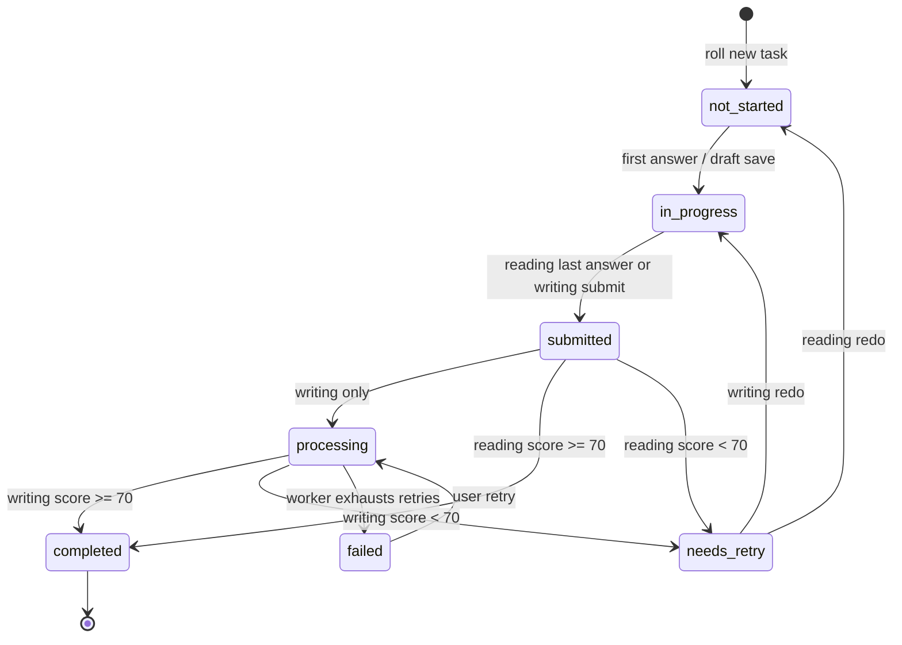

# StoryTeller — Frontend API Contract

This document is the source of truth for every backend endpoint the
StoryTeller web client expects, and the exact JSON shape of every entity it
consumes. The frontend targets the real FastAPI backend through `/api/v1`;
local development should point `VITE_API_BASE_URL` at
`http://localhost:7071/api/v1`. The backend must respond with the shapes
described here.

The TypeScript types in [`app/lib/api/types.ts`](app/lib/api/types.ts) are the
machine-readable mirror of every model below.

---

## 0. Conventions

| Concern              | Rule                                                                                                                          |
| -------------------- | ----------------------------------------------------------------------------------------------------------------------------- |
| Base path            | `/api/v1` — versioned by URL prefix; breaking changes increment the version.                                                  |
| Content type         | `application/json; charset=utf-8` (request and response).                                                                     |
| Field names          | `snake_case` on the wire.                                                                                                     |
| Timestamps           | ISO 8601 UTC, e.g. `"2026-05-06T12:34:56Z"`.                                                                                  |
| IDs                  | Strings (UUIDv7). Static catalog IDs (interests, courses) are short slugs.                                                    |
| Pagination           | Cursor-based (`limit`, `cursor` query params; `next_cursor` in body). Default `limit=20`, max `100`.                          |
| Idempotency          | Mutating endpoints accept `Idempotency-Key: <uuid>`; duplicates return the original response.                                 |
| Tracing              | Every response echoes `X-Request-Id`.                                                                                         |
| Auth                 | Browser-managed cookies: HttpOnly `st_at` access cookie, HttpOnly `rt` refresh cookie, and CSRF token via `st_csrf` plus `X-CSRF-Token`. |
| Errors               | RFC 7807 Problem Details (see §9).                                                                                            |
| Time-zone            | Server returns UTC; client renders in the user's locale.                                                                      |
| Locale               | v1: English only (`display_locale = "en"`).                                                                                   |
| CORS / cookies       | Frontend sends `credentials: "include"` on every API call. Backend must allow-list the SPA origin and expose `X-CSRF-Token`.  |
| CSRF                 | Authenticated unsafe methods (`POST`, `PUT`, `PATCH`, `DELETE`) require `X-CSRF-Token` matching the `st_csrf` cookie.         |

---

## 1. Authentication

### `POST /auth/signup`

Create a new account.

**Request**

```json
{
  "first_name": "Maya",
  "last_name": "Patel",
  "email": "maya@example.com",
  "password": "Snowflake42!",
  "year_of_birth": 2017
}
```

Validation:

- `first_name`, `last_name`: 1–40 chars (letters / spaces / hyphens).
- `email`: RFC 5322, unique.
- `password`: ≥ 8 chars, must contain at least one letter and one digit.
- `year_of_birth`: integer, between `current_year - 100` and `current_year - 5`.
- `english_level` is derived by the server from `year_of_birth` and defaults to
  the conservative grade band below the learner's school grade.

**201 Created**

```json
{
  "user": { ... User object ... }
}
```

Sets `st_at`, `rt`, and `st_csrf` cookies and returns the current CSRF token in
the `X-CSRF-Token` response header. The access and refresh cookies are HttpOnly;
the SPA sends the CSRF token back in the `X-CSRF-Token` request header.

Error codes: `validation_error` (422), `email_taken` (409).

### `POST /auth/login`

```json
// Request
{ "email": "maya@example.com", "password": "..." }

// 200 OK
{ "user": { ... } }
```

Same generic error for invalid email vs. invalid password.

### `POST /auth/google/exchange`

Deprecated. Google sign-in now uses the redirect flow below.

### `GET /auth/google/start`

Query: `return_to` (internal path, default `/dashboard`), `intent` (`login` or
`signup`), and optional `surface` (`app` or `admin`, default `app`). Redirects
to Google OAuth with `openid email profile`.

### `GET /auth/google/callback`

Google redirects here with `code` + `state`. The backend validates state,
exchanges the code, verifies the Google identity, creates or links the user,
sets the session cookies, and redirects to the selected frontend
`/auth/callback?returnTo=<path>`. On failure, redirects there with `error`.

### `POST /auth/refresh`

Cookie-only request using `rt`. **204 No Content** and refreshes `st_at`, `rt`,
and `st_csrf`; also returns the current CSRF token in the `X-CSRF-Token`
response header.

### `POST /auth/logout`

Deletes the app session cookies. **204 No Content**.

### `POST /auth/email/verify/request` · `POST /auth/email/verify/confirm`

Body for confirm: `{ "token": "<one-time>" }`. Both return **204**.

### `POST /auth/password/forgot`

Body: `{ "email": "..." }` — always **204** (no enumeration).

### `POST /auth/password/reset`

Body: `{ "token": "<one-time>", "new_password": "..." }`. **204** on success; revokes all refresh tokens.

---

## 2. Profile

### `GET /me`

Returns the authenticated `User`.

### `PATCH /me`

```ts
{
  first_name?: string;
  last_name?: string;
  phone_number?: string | null;
  theme_preference?: "auto" | "light" | "dark";
  text_size_preference?: "sm" | "md" | "lg";
  reduce_motion?: boolean;
  notif_email_enabled?: boolean;
  notif_inapp_enabled?: boolean;
  english_level?: number; // 0..100
}
```

Returns the updated `User`. If `english_level` changes, the server deletes that
user's old-level unfinished and retryable tasks (`not_started`, `in_progress`,
`submitted`, `processing`, `needs_retry`, and `failed`) and queues fresh
ready-task refills. Completed task history is left unchanged.

New users default to `"light"` for the child experience. Existing users keep
their saved preference, and Settings can still switch to `"auto"` or `"dark"`.

### `PUT /me/interests`

Replaces the user's interest selection.

```json
// Request
{ "interest_ids": ["animals", "space", "games"] }

// 200 OK
{ "interests": ["animals", "space", "games"] }
```

Server enforces `1 ≤ length ≤ 6`. When an interest is removed from the
selection, the server deletes that user's tasks for the removed interest across
all statuses. Other users' tasks and shared generated content remain unchanged.

### `PUT /me/onboarding`

Completes first-run learner setup and returns the updated `User`.

```json
{
  "interest_ids": ["animals", "space"]
}
```

Server validates `1 ≤ interests ≤ 6`. `year_of_birth` remains immutable after
signup; onboarding recalculates the starting `english_level` from that stored
birth year and ignores legacy `year_of_birth` / `grade_level` fields if sent.

### `POST /me/avatar`

`multipart/form-data` with a single `file` part. Accepts PNG, JPEG, or WebP up
to 2 MiB. Returns `{ "avatar_url": "..." }`. `GET /me/avatar` serves the
authenticated user's current avatar bytes.

### `POST /me/password/change`

Body: `{ "current_password": "...", "new_password": "..." }`. **204** + revokes all other sessions.

### `DELETE /me`

Body: `{ "confirm": true }`. **204**, soft-deletes (`status="deleted"`, scrubs PII).

---

## 3. Catalog

### `GET /interests`

Returns `Interest[]`. Static — fully cacheable for 1 day.

### `GET /courses`

Returns `Course[]`. v1 returns the two courses below.

### `GET /courses/{course_id}`

Returns `Course`. `course_id` is `"reading"` or `"writing"`.

---

## 4. Tasks

### `POST /courses/{course_id}/tasks` — Roll a new task

Body (optional): `{ "interest_id": "space" }`.  
Server first returns the user's most relevant unfinished same-course task
(`in_progress`, `processing`, `submitted`, `needs_retry`, `failed`, then
`not_started`). If no such task exists, it creates a new ready task and picks a
random interest from the user's selection when omitted.

**201 Created** — returns a `Task` with the appropriate payload (`reading` for unseen-text, `writing` for short-writing). Reading tasks contain 10 questions, returned **without** their `correct_answer` and `explanation` until the task is completed.

```json
// Reading example
{
  "id": "0192f3...",
  "user_id": "0192f1...",
  "course_id": "reading",
  "course_type": "unseen_text",
  "interest_id": "space",
  "grade_level_at_roll": 4,
  "english_level_at_roll": 24,
  "status": "not_started",
  "title": "The Curious Case of Saturn's Rings",
  "topic_label": "Space & Astronomy",
  "reading": {
    "title": "The Curious Case of Saturn's Rings",
    "passage_paragraphs": ["Saturn is famous for...", "..."],
    "passage_text": "Saturn is famous for...\n\n...",
    "passage_word_count": 220,
    "questions": [
      {
        "id": "q1...",
        "position": 1,
        "question_type": "multiple_choice",
        "prompt": "What are Saturn's rings actually made of?",
        "options": ["A solid sheet of metal", "Billions of pieces of ice and rock", "Frozen clouds of gas", "A thin layer of dust"],
        "max_points": 1
      }
    ]
  },
  "score": null,
  "xp_awarded": 0,
  "started_at": null,
  "submitted_at": null,
  "completed_at": null,
  "failed_at": null,
  "fail_reason": null,
  "passed": null,
  "passing_score": 70,
  "created_at": "2026-05-06T08:32:11Z",
  "updated_at": "2026-05-06T08:32:11Z"
}
```

```json
// Writing example
{
  "id": "0192f5...",
  "course_id": "writing",
  "course_type": "short_writing",
  "interest_id": "travel",
  "status": "not_started",
  "title": "A Place You Would Love to Visit",
  "topic_label": "Travel & Cultures",
  "writing": {
    "title": "A Place You Would Love to Visit",
    "prompt": "Write a short answer (60–120 words)...",
    "hints": ["Mention the place by name", "Use at least two adjectives", "End with a personal reason"],
    "min_words": 60,
    "max_words": 120
  }
}
```

### `GET /tasks` — list

Query params: `status?`, `course_type?`, `cursor?`, `limit?`. Returns `Page<Task>`.

### `GET /tasks/{task_id}`

Returns the full `Task`. While the task is `in_progress`, questions are returned without `correct_answer` / `explanation`.

### `PATCH /tasks/{task_id}/start`

Marks the task `in_progress` and stamps `started_at`. Idempotent. Returns `Task`.

### `POST /tasks/{task_id}/answer` — Reading only

Body:

```json
{ "question_id": "q1...", "answer": 1 }
```

`answer` is the option index for `multiple_choice` / `true_false`, or a string for `fill_blank`. Server stores the answer but does **not** reveal correctness in the response (PRD §6.3).

```json
// 200 OK
{ "accepted": true }
```

### `POST /tasks/{task_id}/submit`

Reading body:

```json
{
  "answers": [
    { "question_id": "q1...", "answer": 1 },
    { "question_id": "q2...", "answer": "pulling" }
  ]
}
```

Reading **200 OK** — returns the full `Task` plus `correct_count` / `total`.
Scores `>= 70` mark `status="completed"` and guarantee one next same-course
`not_started` task is ready. Scores below `70` mark `status="needs_retry"`,
award no completion XP, and do not create the next task.

Writing body:

```json
{ "full_text": "I would love to visit Kyoto..." }
```

Writing **202 Accepted** — `status="processing"`. Backend enqueues the LLM evaluation; the client polls the task or listens on the WebSocket until `status="completed"` or `status="needs_retry"`.

```json
{ "id": "0192f5...", "status": "processing", "submitted_at": "..." }
```

### `POST /tasks/{task_id}/draft` — Writing only

Saves the user's draft (called by the auto-save loop every 10 seconds, PRD §7.2).

```json
// Request
{ "text": "...current draft..." }

// 200 OK
{ "saved_at": "2026-05-06T12:34:56Z" }
```

### `POST /tasks/{task_id}/retry`

Re-queues a `failed` writing task. **202 Accepted**.

### `POST /tasks/{task_id}/redo`

Resets a `needs_retry` task for another attempt. Reading answers are cleared and
the task returns to `not_started`. Writing keeps the previous answer as an
editable draft and returns to `in_progress`. **200 OK** returns `Task`.

### `GET /tasks/{task_id}/result`

Returns a `TaskResult` (reading or writing — discriminated by `mode`). Reading
results unmask the correct answer and explanation for `completed` and
`needs_retry` tasks. Writing results return the full `WritingEvaluation` once
feedback is available; `evaluation` is `null` while still `processing`.
Failed writing results include `fail_reason` so the client can offer a retry.
Passing reading and writing results include `next_task` when a same-course
`not_started` task is already prepared.

---

## 5. Dashboard / Achievements / Notifications

### `GET /me/dashboard`

The aggregated home-screen response. Recommended for a single round trip on Dashboard load.

```ts
interface DashboardResponse {
  greeting: string;
  metrics: DashboardMetrics;
  in_progress: RecentTask[];
  recent: RecentTask[];          // newest first, max 20
  ready_tasks: {
    reading: ReadyTaskSummary | null;
    writing: ReadyTaskSummary | null;
  };
  recommended: Course[];          // top picks for the user (typically 2)
  achievements_recent: Achievement[];
}
```

### `GET /me/metrics`

Returns just `DashboardMetrics`.

### `GET /me/achievements`

Returns `Achievement[]` (every badge, with `earned` + `earned_at`).

### `GET /me/notifications`

Returns `Page<Notification>` — newest first.

### `POST /me/notifications/{id}/read` · `POST /me/notifications/read-all`

Both return **204**.

---

## 6. Real-time

The frontend prefers a WebSocket subscription but will fall back to polling
the relevant `Task` every 5 seconds when `status === "processing"` (PRD §7.3).

### `GET /ws`

Upgrade with `Sec-WebSocket-Protocol: bearer.<jwt>`. Server-pushed messages:

```ts
type WsMessage =
  | { type: "task.completed"; task_id: string; score: number }
  | { type: "task.failed";    task_id: string; reason: string }
  | { type: "achievement.earned"; achievement_id: string }
  | { type: "streak.updated"; current_streak: number };
```

### `GET /me/notifications/poll`

Long-poll fallback (25 s timeout) returning `Notification[]` of any new events.

---

## 7. Health & Ops

| Path        | Purpose                                                                |
| ----------- | ---------------------------------------------------------------------- |
| `/healthz`  | Liveness — always 200 if the process is up.                            |
| `/readyz`   | Readiness — 503 on dependency failure (DB, Redis, LLM).                |
| `/metrics`  | Prometheus exposition (separate port, internal-only).                  |

---

## 8. Admin Console

All admin endpoints are under `/api/v1/admin`, require an active authenticated
user with `role="admin"`, send `Cache-Control: no-store`, and are consumed only
by the separate admin static app. Frontend authorization is UX only; backend
role checks are authoritative.

Bootstrap admin emails come from `ADMIN_BOOTSTRAP_EMAILS` and default to
`["reubinoff@gmail.com"]`. Bootstrap admins are protected from demotion and
suspension through the admin API.

### `GET /admin/session`

Returns the authenticated admin session.

```ts
interface AdminSession {
  user: AdminUserSummary;
  protected_admin: boolean;
}
```

### `GET /admin/overview`

Query: `range_days=7|30|90` (default `30`). Returns aggregate user/task KPIs,
daily activity buckets, and course completion metrics.

### `GET /admin/token-usage`

Query: `range_days=7|30|90` (default `30`). Returns LLM token usage analytics
for recorded usage events in the selected range: totals, daily buckets, top
users, top tasks, operation/model breakdowns, and a next-30-days forecast.
`cost_usd` values are estimates from configured per-model token pricing; events
without configured pricing are counted in `unknown_cost_events`.

### `GET /admin/users`

Query: `query`, `role`, `status`, `limit`, `cursor`. Returns
`Page<AdminUserSummary>` newest users first.

### `GET /admin/users/{user_id}`

Returns `AdminUserDetail`.

### `PATCH /admin/users/{user_id}/admin`

Request: `{ "is_admin": true | false }`. Promotes active users to admin or
demotes admins to user. Blocks self-demotion, protected-admin demotion, and
removing the last active admin.

### `PATCH /admin/users/{user_id}/status`

Request: `{ "status": "active" | "suspended" }`. Suspends/reactivates users.
Blocks self-suspension, protected-admin suspension, and suspending the last
active admin.

### `GET /admin/audit`

Query: `target_user_id`, `limit`, `cursor`. Returns `Page<AdminAuditEvent>`.

---

## 9. Errors (RFC 7807)

```json
HTTP/1.1 422 Unprocessable Entity
Content-Type: application/problem+json
X-Request-Id: 0192f7...

{
  "type": "https://errors.storyteller.app/validation_error",
  "title": "Validation failed",
  "status": 422,
  "code": "validation_error",
  "detail": "One or more fields are invalid.",
  "errors": [
    { "field": "password", "message": "Must be at least 8 characters." },
    { "field": "year_of_birth", "message": "Must be between 1925 and 2020." }
  ]
}
```

Recognised `code` values currently used by the frontend:

| Code                  | Status | Meaning                                                       |
| --------------------- | ------ | ------------------------------------------------------------- |
| `validation_error`    | 422    | Pydantic / zod validation failed.                             |
| `unauthenticated`     | 401    | No valid session — frontend redirects to `/login`.            |
| `email_taken`         | 409    | Sign-up email already in use.                                 |
| `invalid_credentials` | 401    | Login: email or password wrong (generic, no enumeration).     |
| `not_found`           | 404    | Resource missing.                                             |
| `invalid_state`       | 400    | Task transition not allowed for current status.               |
| `admin_required`      | 403    | Authenticated user is not an admin.                           |
| `protected_admin`     | 403    | Bootstrap admin cannot be demoted or suspended.               |
| `admin_safety_violation` | 409 | Admin action would remove a required safety guard.             |
| `rate_limited`        | 429    | Per-user task-roll or eval limit exceeded.                    |

---

## 10. Task status state machine



Reading tasks skip `submitted`/`processing` in the current implementation — submit
returns 200 with `status="completed"` or `status="needs_retry"`. Writing tasks
always pass through `processing`.

---

## 11. Data models (TypeScript)

The full type set is exported from
[`app/lib/api/types.ts`](app/lib/api/types.ts). Reproduced here for backend
codegen reference.

```ts
export type ISO8601 = string;
export type UUID = string;

// ----- Auth -----
interface AuthResponse { user: User; }
interface PasswordChangeRequest { current_password: string; new_password: string; }
interface DeleteAccountRequest { confirm: boolean; }
interface AvatarUploadResponse { avatar_url: string; }
interface AdminSetAdminRequest { is_admin: boolean; }
interface AdminSetStatusRequest { status: "active" | "suspended"; }

// ----- User -----
type ThemePreference = "auto" | "light" | "dark";
type TextSizePreference = "sm" | "md" | "lg";
type UserRole = "user" | "admin" | "support";
type UserStatus = "active" | "suspended" | "deleted";

interface User {
  id: UUID;
  email: string;
  email_verified: boolean;
  first_name: string;
  last_name: string;
  year_of_birth: number;
  grade_level: number;             // 1..12
  english_level: number;           // 0..100
  phone_number: string | null;
  avatar_url: string | null;
  display_locale: string;          // "en" in v1
  theme_preference: ThemePreference;
  text_size_preference: TextSizePreference;
  reduce_motion: boolean;
  notif_email_enabled: boolean;
  notif_inapp_enabled: boolean;
  interests: InterestId[];
  role: UserRole;
  status: UserStatus;
  created_at: ISO8601;
  onboarding_completed: boolean;
}

// ----- Catalog -----
type InterestId =
  | "animals" | "sports" | "music" | "movies" | "science" | "space"
  | "tech" | "food" | "travel" | "art" | "books" | "games"
  | "history" | "cars" | "health";

interface Interest {
  id: InterestId;
  display_name: string;
  emoji: string;
  display_order: number;
}

type CourseId = "reading" | "writing";
type CourseType = "unseen_text" | "short_writing";

interface Course {
  id: CourseId;
  slug: string;
  type: CourseType;
  title: string;
  subtitle: string;
  description: string;
  min_grade: number;
  max_grade: number;
  estimated_minutes: number;
  illustration: "reading" | "writing";
}

// ----- Tasks -----
type TaskStatus =
  | "not_started" | "in_progress" | "submitted"
  | "processing" | "completed" | "needs_retry" | "failed";

type QuestionType = "multiple_choice" | "true_false" | "fill_blank";

interface TaskQuestion {
  id: UUID;
  position: number;
  question_type: QuestionType;
  prompt: string;
  options: string[] | null;
  /** Hidden until task is completed */
  correct_answer?: string;
  /** Hidden until task is completed */
  explanation?: string;
  max_points: number;
}

interface ReadingPayload {
  title: string;
  passage_text: string;
  passage_paragraphs: string[];
  passage_word_count: number;
  questions: TaskQuestion[];
}

interface WritingPayload {
  title: string;
  prompt: string;
  hints: string[];
  min_words: number;
  max_words: number;
  draft?: string;
}

interface Task {
  id: UUID;
  user_id: UUID;
  course_id: CourseId;
  course_type: CourseType;
  interest_id: InterestId;
  grade_level_at_roll: number;     // school/age context at roll time
  english_level_at_roll: number;   // difficulty level at roll time
  status: TaskStatus;
  title: string;
  topic_label: string;
  reading?: ReadingPayload;        // only when course_type === "unseen_text"
  writing?: WritingPayload;        // only when course_type === "short_writing"
  score: number | null;            // 0..100
  xp_awarded: number;
  started_at: ISO8601 | null;
  submitted_at: ISO8601 | null;
  completed_at: ISO8601 | null;
  failed_at: ISO8601 | null;
  fail_reason: string | null;
  passed: boolean | null;
  passing_score: number;           // 70
  created_at: ISO8601;
  updated_at: ISO8601;
}

interface ReadyTaskSummary {
  id: UUID;
  course_id: CourseId;
  course_type: CourseType;
  status: "not_started";
  title: string;
  topic_label: string;
}

// ----- Results -----
interface ReadingResult {
  task_id: UUID;
  mode: "reading";
  score: number;             // correct count
  total: number;
  percentage: number;        // 0..100
  duration_seconds: number;
  xp_earned: number;
  passed: boolean;
  passing_score: number;     // 70
  next_task: ReadyTaskSummary | null;
  questions: Array<TaskQuestion & {
    user_answer: string | number | null;
    is_correct: boolean;
  }>;
}

type HighlightKind = "grammar" | "word_choice" | "suggestion";

interface WritingHighlight {
  start: number;             // character offset in answer_text
  end: number;
  kind: HighlightKind;
  message: string;
}

interface WritingEvaluation {
  score_overall: number;     // 0..100
  score_grammar: number;
  score_vocabulary: number;
  score_structure: number;
  score_relevance: number;
  feedback_summary: string;          // single paragraph for the hero card
  feedback_detail: string[];         // additional paragraphs
  focus_next: string[];              // chips ("Past tense for habits", ...)
  highlights: WritingHighlight[];    // anchored to answer_text
}

interface WritingResult {
  task_id: UUID;
  mode: "writing";
  status: TaskStatus;
  answer_text: string;
  evaluation: WritingEvaluation | null;
  fail_reason: string | null;
  xp_earned: number;
  passed: boolean | null;
  passing_score: number;     // 70
  next_task: ReadyTaskSummary | null;
  submitted_at: ISO8601 | null;
  completed_at: ISO8601 | null;
}

type TaskResult = ReadingResult | WritingResult;

// ----- Dashboard / Achievements / Notifications -----
interface DashboardMetrics {
  tasks_completed: number;
  current_streak: number;
  longest_streak: number;
  avg_score: number;        // 0..100
  xp_total: number;
  level: number;
  level_label: string;      // "Apprentice", "Adept", ...
}

interface RecentTask {
  id: UUID;
  course: string;
  course_type: CourseType;
  topic: string;
  status: TaskStatus;
  score: number | null;
  when: string;             // human-readable "2 hr ago"
  progress: TaskProgress | null;
  passed: boolean | null;
  passing_score: number;    // 70
}

interface DashboardResponse {
  greeting: string;
  metrics: DashboardMetrics;
  in_progress: RecentTask[];
  recent: RecentTask[];
  ready_tasks: {
    reading: ReadyTaskSummary | null;
    writing: ReadyTaskSummary | null;
  };
  recommended: Course[];
  achievements_recent: Achievement[];
}

interface Achievement {
  id: string;
  slug: string;
  name: string;
  description: string;
  icon: string;             // emoji
  earned: boolean;
  earned_at: ISO8601 | null;
}

interface Notification {
  id: UUID;
  kind: "task_completed" | "task_failed" | "streak_milestone" | "system";
  payload: Record<string, unknown>;
  read_at: ISO8601 | null;
  created_at: ISO8601;
}

// ----- Admin -----
interface AdminSession {
  user: AdminUserSummary;
  protected_admin: boolean;
}

interface AdminOverview {
  range_days: 7 | 30 | 90;
  generated_at: ISO8601;
  kpis: {
    users_total: number;
    users_active: number;
    users_suspended: number;
    admins_total: number;
    signups_in_range: number;
    tasks_created_in_range: number;
    tasks_completed_in_range: number;
    tasks_failed_in_range: number;
    writing_processing: number;
    avg_completed_score: number;
  };
  daily_activity: Array<{
    date: string;
    signups: number;
    tasks_created: number;
    tasks_completed: number;
  }>;
  course_metrics: Array<{
    course_type: string;
    completed_count: number;
    avg_score: number;
  }>;
}

interface AdminTokenUsage {
  range_days: 7 | 30 | 90;
  generated_at: ISO8601;
  totals: {
    input_tokens: number;
    output_tokens: number;
    cache_write_tokens: number;
    cache_read_tokens: number;
    total_tokens: number;
    requests: number;
    cost_usd: number;
    unknown_cost_events: number;
  };
  daily: Array<{
    date: string;
    input_tokens: number;
    output_tokens: number;
    cache_write_tokens: number;
    cache_read_tokens: number;
    total_tokens: number;
    requests: number;
    cost_usd: number;
  }>;
  top_users: Array<{
    user_id: UUID;
    email: string;
    first_name: string;
    last_name: string;
    total_tokens: number;
    requests: number;
    cost_usd: number;
  }>;
  top_tasks: Array<{
    task_id: UUID;
    title: string;
    course_type: string;
    user_id: UUID | null;
    user_email: string | null;
    total_tokens: number;
    requests: number;
    cost_usd: number;
  }>;
  by_operation: Array<{
    key: string;
    label: string;
    total_tokens: number;
    requests: number;
    cost_usd: number;
  }>;
  by_model: Array<{
    key: string;
    label: string;
    total_tokens: number;
    requests: number;
    cost_usd: number;
  }>;
  forecast_30d: {
    days: number;
    total_tokens: number;
    cost_usd: number;
    avg_daily_tokens: number;
    avg_daily_cost_usd: number;
  };
}

interface AdminUserSummary {
  id: UUID;
  email: string;
  first_name: string;
  last_name: string;
  role: UserRole;
  status: UserStatus;
  protected_admin: boolean;
  created_at: ISO8601;
  updated_at: ISO8601;
  tasks_total: number;
  tasks_completed: number;
  avg_score: number | null;
  last_activity_at: ISO8601 | null;
}

interface AdminUserDetail extends AdminUserSummary {
  email_verified: boolean;
  grade_level: number;
  english_level: number;
  year_of_birth: number;
  onboarding_completed: boolean;
  interests: InterestId[];
  task_status_counts: Array<{ status: TaskStatus; count: number }>;
}

interface AdminAuditEvent {
  id: UUID;
  actor_user_id: UUID | null;
  actor_email: string | null;
  target_user_id: UUID;
  target_email: string | null;
  action: string;
  metadata: Record<string, unknown>;
  created_at: ISO8601;
}

// ----- Errors -----
interface Problem {
  type: string;
  title: string;
  status: number;
  detail?: string;
  code: string;
  errors?: Array<{ field: string; message: string }>;
}
```

---

## 12. Front-end behaviour notes (for backend planning)

- The client polls `GET /tasks/{id}` and `GET /tasks/{id}/result` every 5 s while a writing task is `processing`. Worker SLA: complete within 30 s p95.
- The client auto-saves writing drafts every 10 s via `POST /tasks/{id}/draft`. Backend should idempotently overwrite the latest draft only before submission.
- The dashboard fetches `/me/dashboard` on every visit. Aim for p95 < 300 ms.
- The catalog (`/interests`, `/courses`) is treated as immutable for the session; the frontend caches it for an hour.
- The shell topbar shows `current_streak` and `xp_total` from `/me/metrics`; both must be returned as a single integer (no localisation on the wire).
- Any auth, user, role/status, metrics, task/content model, CORS, cookie, or
  deployment change must consider the separate admin console and its admin-only
  API surface.

---

## 13. Open questions tracked for v2

1. Reading task — should `POST /tasks/{id}/answer` allow updates (going back) or remain append-only? Currently treated as append-only.
2. Writing rubric weights — are sub-scores plain averages, or weighted? Frontend just renders whatever the backend returns.
3. Streaks — does a streak survive weekends, or only count actual activity days?
4. Parental consent (COPPA): are under-13 sign-ups blocked or gated?
5. Multiple languages — v2 is expected to need `display_locale` switching; the wire shape already supports it.
